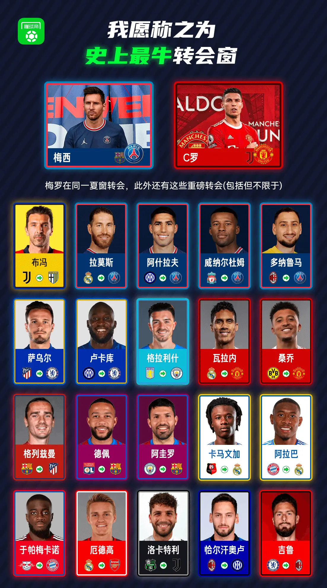
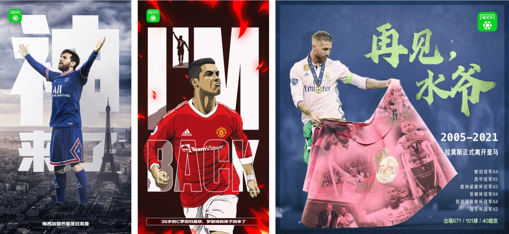
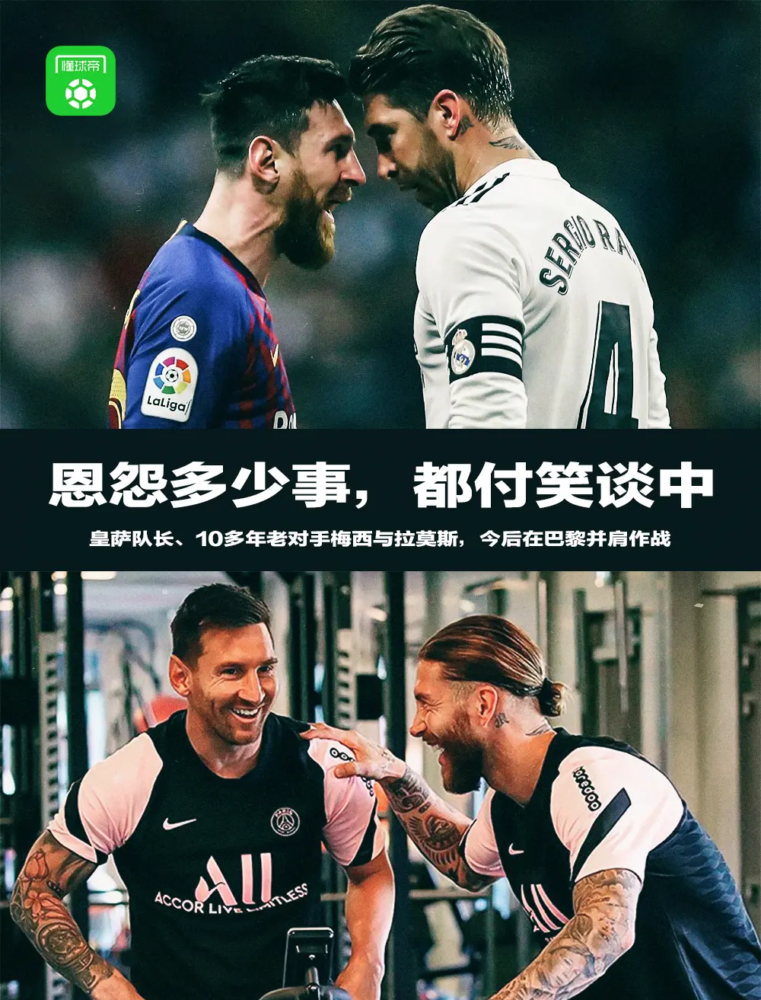
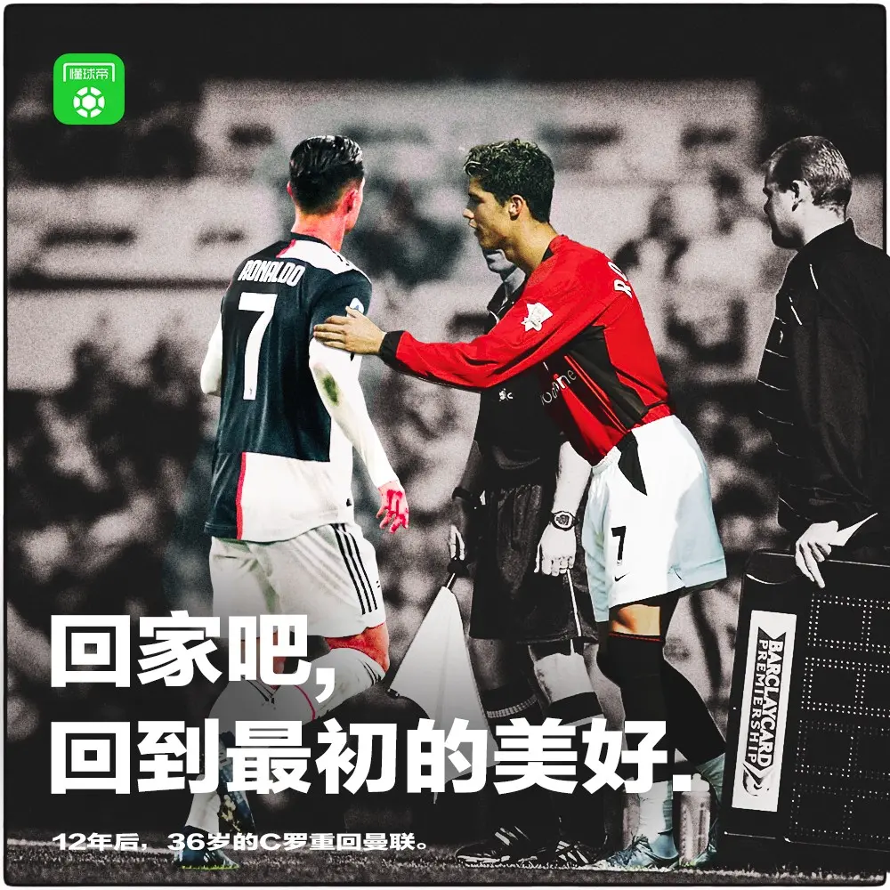
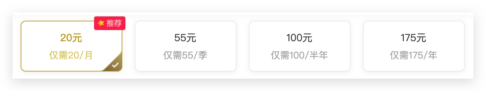
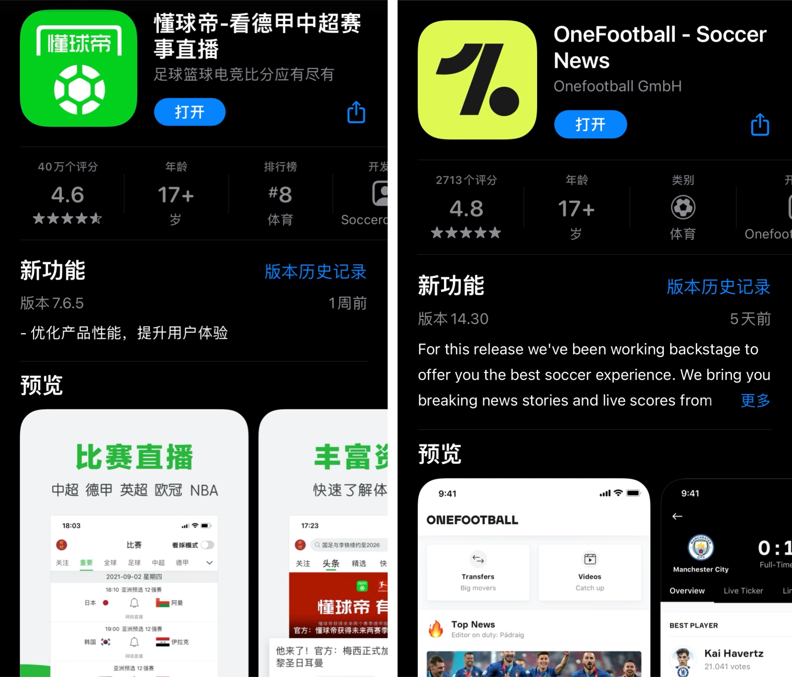

# 21-22赛季足球联赛观看指南

> 一男子没上过大学，34岁失业，之前一直从事体力劳动，需要养育三个儿子，老婆也没有工作！他叫梅西！

> 2021年的夏天是不是史上最牛的转会窗现在还不好评价，但21年的夏天绝对拥有空前绝后的电影般的剧情。哪怕是从来不关注足球的人，也都一定听说了梅西泪别效力了21年的俱乐部。本以为这已经是这个夏天故事的高潮了，没想到在转会窗口快要关闭前，又有C罗重返曼联梦剧场的情节。

## 新赛季看点

8月份的尾巴，欧洲足球五大联赛纷纷拉开了新赛季的序幕。8月27日，欧冠联赛小组赛阶段抽签尘埃落定。9月1日，五大联赛转会窗口的关闭，热闹了一个夏天的转会市场，终于暂时的安静了下来。受新冠疫情影响空场了半年多的体育场，终于迎回了受限制人数的球迷的主场观战。

盘点赛季初的比赛看点，球迷们大都还在津津乐道地回味着夏天一笔笔交易之后，各大豪门组建的新阵容。只是年年岁岁花相似，对于转会交易而言，真是几家欢喜几家愁。

- 梅西泪别巴塞罗那加盟大巴黎
- C罗离开尤文图斯重返曼联
- 拉莫斯离开皇马加盟大巴黎
- 格里兹曼租借重返马德里竞技

梅西13岁就来到巴塞罗那，在一张餐巾纸上签下了第一份协议。21年后，巴塞罗那俱乐部因为经济原因无法完成续约，梅西在合同到期后，不得不泪洒离别的发布会现场。随后巴黎圣日耳曼俱乐部官方宣布梅西加盟。梅西与内马尔重聚(当年叱诧欧洲的MSN组合)。此外，巴塞罗那和皇家马德里作为西班牙🇪🇸国内的世纪死敌，这个夏天两家俱乐部的前队长同时加盟大巴黎，诠释了什么叫“没有永远的敌人”。

当年登陆老特拉福德(曼联主场)时，还是意气风发的“小小罗”，在皇马和尤文兜兜转转了12年之后，如今已贵为“总裁”的C罗，重新回到曼联，回到梦开始的地方。而且，曼联的队员卡瓦尼同意让出7号球衣，交还给它曾经的主人。时过境迁，已经36岁的C罗，不知能否归来还是少年？

## 足球联赛通识普及课

作为一个看球10多年的“老球痞”，在上文中兴之所至的讲述了一下被称作“绝代双娇”的梅西和C罗的今夏转会，凭借着全是自己冠一股子激情。但是对于新球迷或者准备入坑的准球迷来说，有的足坛黑话理解起来未免云里雾里。因此还是简单科普一下足球联赛的零零总总。

首先，不同于世界杯或洲际杯(比如欧洲杯、美洲杯、亚洲杯等)的N年一届，足球联赛每年都会组织。欧洲联赛一般是从当年的8月到次年的5月，为一个完整的赛季，所以这一期的新赛季观赛指南，指的是2021年-2022年赛季。

而为广大中国球迷所熟悉的五大联赛，指的是欧洲5个国家的顶级足球联赛，分别是英国🇬🇧的英超、西班牙🇪🇸的西甲、德国🇩🇪的德甲、意大利🇮🇹的意甲和法国🇫🇷的法甲。除此之外，还有整个欧洲按不同国家实力分配名额的欧洲冠军联赛(简称“欧冠”)和欧足联欧洲联赛(简称“欧联”)。参加这些比赛的，都是各个国家的足球俱乐部，相对的，像世界杯和洲际杯赛，参加的则是所谓的国家队。

联赛分为主客场积分制，各国联赛的所有参赛球队，两两之间都会比赛两场(一主一客)。联赛的比赛不设加时赛和点球大战，获胜的队伍全取3分，打平了话双方各加一分，输了的球队这一轮则没有积分入账(0分)。赛季结束后，积分最高的队伍将获得联赛冠军，如果有积分相同的，则根据各国联赛的规则，比较同分队伍的胜负关系等数据决定冠军的归属。

欧洲冠军联赛则略为不同，分为小组赛阶段和淘汰赛阶段。小组赛阶段也是采用积分制，每个小组最高的前两名出线，重新抽签后进入淘汰赛阶段。淘汰赛阶段每一场较量都是一主一客的两场比赛，先后比较总比分和客场进球(总比分相同的情况下才比较客场进球)决定胜负。顾名思义，淘汰赛阶段输球的队伍就只能回家。而打到决赛的两支队伍，将会在赛季开赛前已经决定好的中立场地一场定胜负，赢球的队伍就能捧得大耳朵杯(欧冠冠军奖杯)。所以欧冠从淘汰赛阶段到决赛，都有加时赛和点球大战。

对于一直欧洲的俱乐部来说，**每年最重要的两个冠军就是本国的联赛冠军和象征着欧洲之巅的欧冠冠军**。而且除开世界杯年，代表着球员个人最高荣誉的金球奖的评选，也会很大程度上参考球员在联赛和欧冠上的表现。除此之外，还有一些各国足协组织的杯赛，这些比赛的冠军，对于俱乐部来说，就属于锦上添花了。不过一个俱乐部如果能够获得其参与的所有赛事的冠军，对于球员、教练甚至于球迷来说，就是一个完美的赛季，会被人冠以“N冠王”的荣誉。

## 去哪儿能看到比赛

如果想快速的找到收看平台，就看以下这张表格即可。

| 联赛    | 收看平台  |
|-------|-------|
| 英超    | 咪咕视频、爱奇艺体育 |
| 西甲    | 咪咕视频、爱奇艺体育 |
| 德甲    | 咪咕视频、腾讯体育、虎牙直播、懂球帝   |
| 法甲    | 咪咕视频  |
| 意甲    | 咪咕视频  |
| 欧冠    | 咪咕视频、腾讯体育、爱奇艺体育、PP体育 |
| 欧联    | 咪咕视频、腾讯体育、爱奇艺体育、PP体育 |
| 中超    | 咪咕视频、腾讯体育、懂球帝  |

可以看到，新赛季咪咕视频一骑绝尘，拿下了五大联赛的所有转播权。而且咪咕视频开辟了新的付费玩法——通看券。球迷可以根据实际需求自由选择: 15元包月（内含10张通看券）和30元包月（内含30张通看券）两种包月券包。除了按月付费之外，咪咕的通用券包还提供按季度付费和按次加油包。但是要想享受到1080P的画质，则需要先开通咪咕视频的钻石会员，其收费入下图所示:

爱奇艺体育则推出了238元的`英超全季通`和`西甲全季通`，开通会员后，球迷可享受1080p 50帧的高清直播。如果球迷不仅仅关注意向赛事，还可以考虑318元的足球年卡，包含英超、西甲、欧冠、亚冠、世亚预12强赛等比赛。

腾讯体育则分为`体育VIP`和`体育超级VIP`两档会员，目前连续包月价格分别为25元/月和60元/月。二者间差别在于收看NBA、德甲赛事时是否需扣除每个月数量有限的观赛券。

而对于德甲来说，虎牙直播和懂球帝则都提供免费的赛事直播。另外，腾讯宣布21-22赛季全场次免费播放欧冠和欧联的比赛。

当然，除开价格以外，有部份挑剔的球迷还会挑解说。各个平台签约的足球解说也是有好坏之分的。像吼出了“伟大的左后卫”的前央视解说黄健翔，则是在咪咕视频旗下。

关于解说，可以大致的看一下这张表:

| 视频平台 | 解说嘉宾                                 |
|------|--------------------------------------|
| 咪咕视频 | 詹俊、张路、黄健翔、娄一晨、刘越、李欣、梁祥宇、刘焕、贺宇、徐阳、苗锟等 |
| 爱奇艺  | 苏东、金相凯、刘晶捷、于鑫淼等                      |
| 腾讯视频 | 颜强、徐亮、杨晨等                            |

## 比赛以外的狂欢

作为一名地道的足球球迷，光看比赛怎么过瘾呢？看完自己心爱的球队的比赛，不管场面荡气回肠还是平淡无奇，都会想着找人聊聊。不过工作之后很少能够有一起看球的小伙伴了。好在互联网给我们提供了新的交(si)流(bi)的平台。

国内目前的主要足球平台就是自称为D站的绿色app——懂球帝。可以关注自己感兴趣的球队、联赛和球星，像刷抖音一样的刷一刷他们的最新消息。懂球帝的优势是与足球的数据十分全面，适合在吹牛逼之前，之时和之后查阅事实证据。不过懂球帝的新闻有点儿过多，我不喜欢它的无关推送，就把通知给关了。所以比赛开始的通知我推荐用国外的一款app——OneFootball。同样是订阅了主队之后，比赛开始以及比赛中重要的赛况(进球、红黄牌等)会实时推送。而自己关注的球队的新闻每天推送的条数很克制。而且OneFootball是纯英文的，可以培养自己的英语阅读习惯。

> "32岁的亨利就坐在那里，深情的目光望过去，都是自己22岁的影子。"

不知道大家有没有听说过这句在球迷圈中耳熟能详的台词。没错，就是来自央视每周一晚7点半的《天下足球》。《天下足球》节目最值得推荐的就是他们出的某某球星特辑，此外还有经过精挑细选的BGM。

## 最后

热爱足球的方式有很多种，在文章的最后，我还想给各位一个大胆的建议。买一双足球鞋，走上球场吧。自己去踢球，不仅能锻炼身体，还会认识很多很多的朋友。